# big-data-processing-toolbox

## Images on Docker Hub
  UI App

   https://hub.docker.com/repository/docker/xxpan/big-data-app

  Jupyter Notebook

    https://hub.docker.com/r/jupyter/datascience-notebook
    docker pull jupyter/datascience-notebook:latest

  Apache Spark

    https://hub.docker.com/r/bitnami/spark  
    docker pull bitnami/spark:latest

  Apache Hadoop (master and worker nodes)

  Namenode

    https://hub.docker.com/r/bde2020/hadoop-namenode
    docker pull bde2020/hadoop-namenode:2.0.0-hadoop3.2.1-java8

  Datanode

    https://hub.docker.com/r/bde2020/hadoop-datanode
    docker pull bde2020/hadoop-datanode:2.0.0-hadoop3.2.1-java8

  SonarQube

    https://hub.docker.com/_/sonarqube
    docker pull sonarqube:latest

## Prerequisites
- Install Docker
- Install kubectl
- Install Helm 

  https://helm.sh/docs/using_helm/#installing-helm

  **Helm** is a tool that maintains the relationship of Kubernetes objects within a cluster. Helm helps manage Kubernetes applications. Helm Charts are the primary means of organizing these relationships. Helm Charts helps you define, install, and upgrade even the most complex Kubernetes application. Helm Charts are composed of template files that can be parameterized to deploy uniquely configured versions of an application.

  Check if you install helm properly.

      helm --help

- Install GCP CLI
- Create GCP project
- Authenticate GCP CLI

      gcloud auth login

- Set GCP project

       gcloud config set project PROJECT_ID

## Cluster setup
**Create Kubernete cluster**

    gcloud container clusters create bigdatacluster --zone=us-east1-d --num-nodes=1 --machine-type=custom-4-12288 
    gcloud container clusters get-credentials bigdatacluster --zone=us-east1-d

**Check kubectl context**

  Check if your kubectl context is set to the cluster that you created in the previous step.

    kubectl config get-contexts 
  
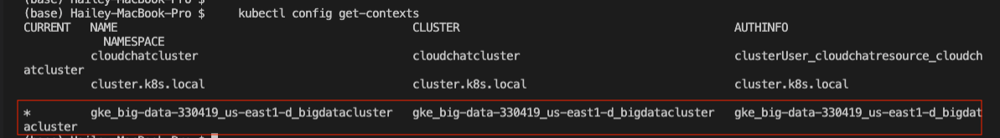

  Otherwise, set the default context to the previously created cluster

    kubectl config use-context CLUSTER_CONTEXTS    

## Install Helm charts to deploy microservices. Run the following instructions at the root of this repo.

**Deploy Jupyter Notebook**

The Jupyter-notebook Helm chart produces one service and one deployment.

    helm install jupyter helm/jupyter/

**Deploy Sonarqube**

The Sonarqube Helm chart produces one configMap, one service and one deployment.

    helm install sonar helm/sonarqube

**Deploy Spark**

Step 1 - Install master 

The Spark master Helm chart produces one configMap, one stateful set and one service.

      helm install master helm/spark/master
      
Step 2 - Install worker

The Spark worker Helm chart produces one configMap, one stateful set and one service.
    
a. Use the following command to find the external IP address of the `spark-service`.

    kubectl get service spark-service

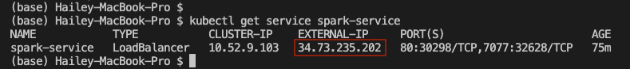

b. Replace the IP address at line 7 in `helm/spark/worker/configMap.yaml` with `spark-service`'s IP address.

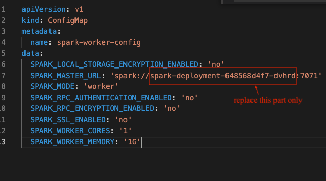

c. Lastly, run the following to deploy worker

    helm install worker helm/spark/worker

**Deploy Hadoop**

Step 1 - Install namenode

The Hadoop namenode Helm chart produces one configMap, one stateful set and two services, one for the namenode UI and one for internal communication with the datanode.

    helm install namenode helm/hadoop/namenode

Step 2 - Install datanode

The Hadoop datanode Helm chart produces one configMap, one stateful set and two services, one for the datanode UI and one for internal communication with the namenode.

    helm install datanode helm/hadoop/datanode

**Deploy Driver UI Application**

Step 1 - Find the external IP addresses and port for the following services, `namenode-ui`, `sonarqube-service`, `jupyter-service`, `spark-service`.

    kubectl get svc jupyter-service namenode-ui sonarqube-service spark-service

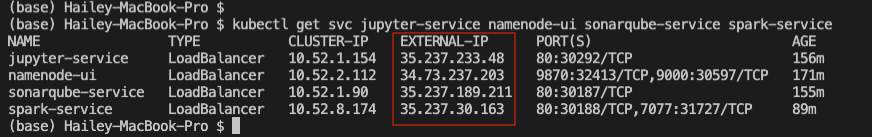

Step 2 - Replace the IP addresses from Line 2-5 in `big-data-processing-toolbox-app/src/config.js` with the IP adderss and port that you found in the previous step. Follow the comments in the file. **Note that namenode services has the port number 9870.** 

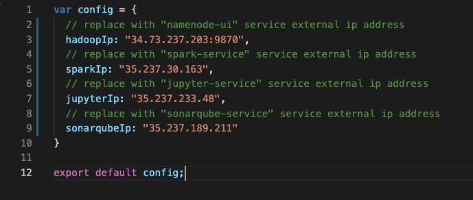

Step 3 - Build the UI App Image

    docker build -t big-data-app:latest . -f docker/ui-app/Dockerfile

Step 4 - Push the image to a repo at your choice

    docker tag big-data-app:latest YOUR_REPO_NAME/big-data-app:latest

    docker push YOUR_REPO_NAME/big-data-app:latest

Step 5 - Set the image url at Line 19 in `helm\ui-app\deployment.yaml`

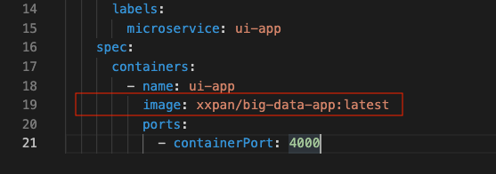

Step 6 - Deploy the UI app

The UI app Helm chart produces a stateful set and a serivce.

    helm install ui-app helm/ui-app

**This UI app deploymen takes awhile due to the application build time. Grab a coffee and come back to check the UI app.**	&#128516;

You can monitor the application start status by `kubectl logs ui-app-0`, the application is ready when you see the following in the pod's log.

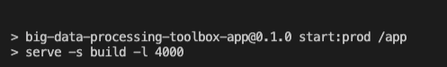

## Check the full deployment
By now, all microservices should be ready to work. Please check the following to make sure you have everything.

1. check installed Helm charts

        helm list

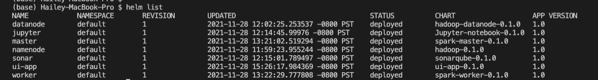

2. check services

        kubectl get service

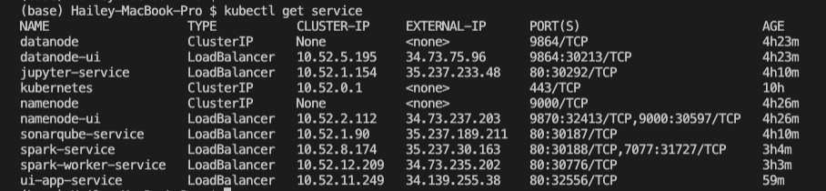

3. check deployment

        kubectl get deployment

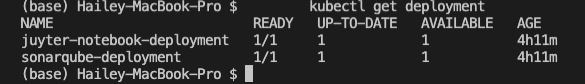

4. check stateful set

        kubectl get statefulset

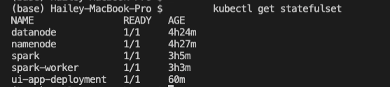

5. check GCP console UI

**Kubernetes Engine** -> **Clusters**
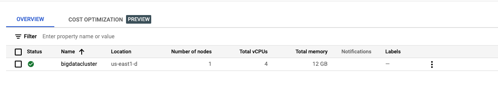

**Kubernetes Engine** -> **Workloads**
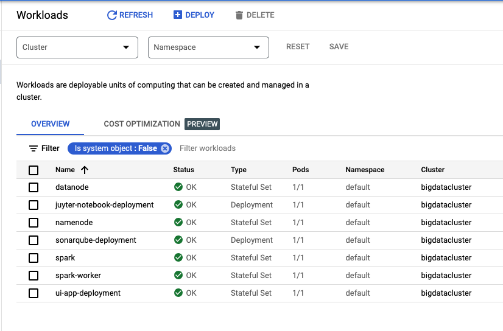

**Kubernetes Engine** -> **Services and Ingress**
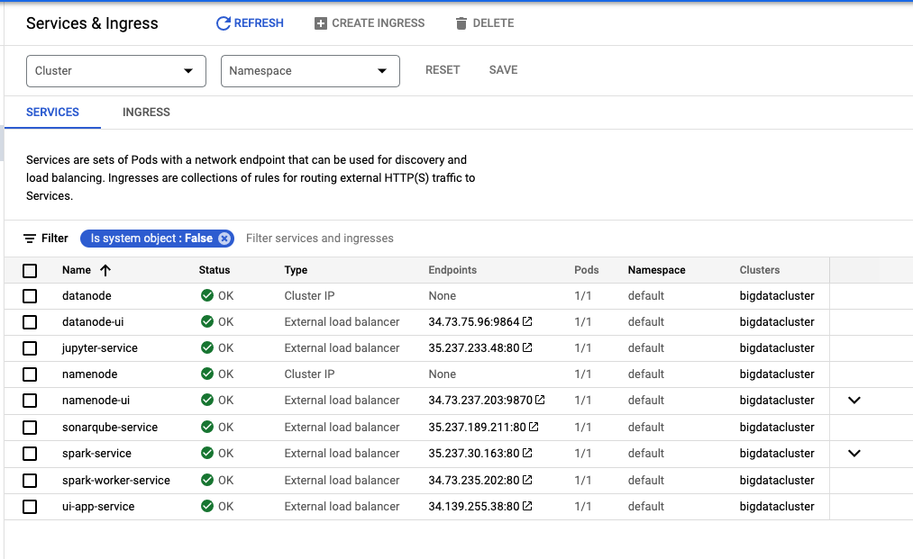

## Nevigate to the UI app
 
Find the external IP of the `ui-app-service`.

      kubectl get service ui-app-service  

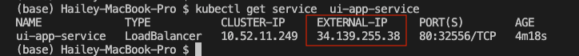
  
Nevigate to the IP address in the browser to see the UI app. Click on each link to neviagea to different microservices.

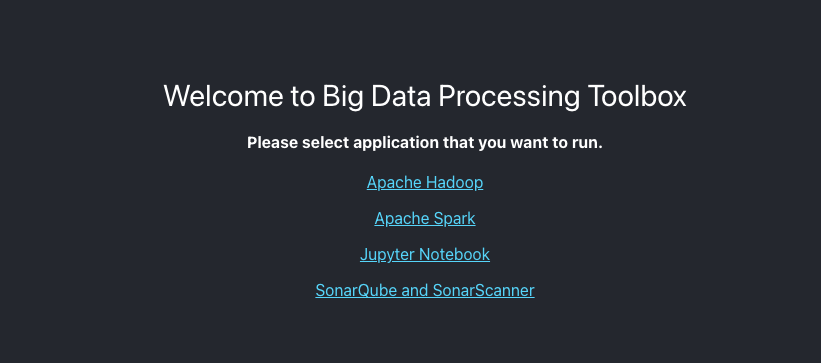

