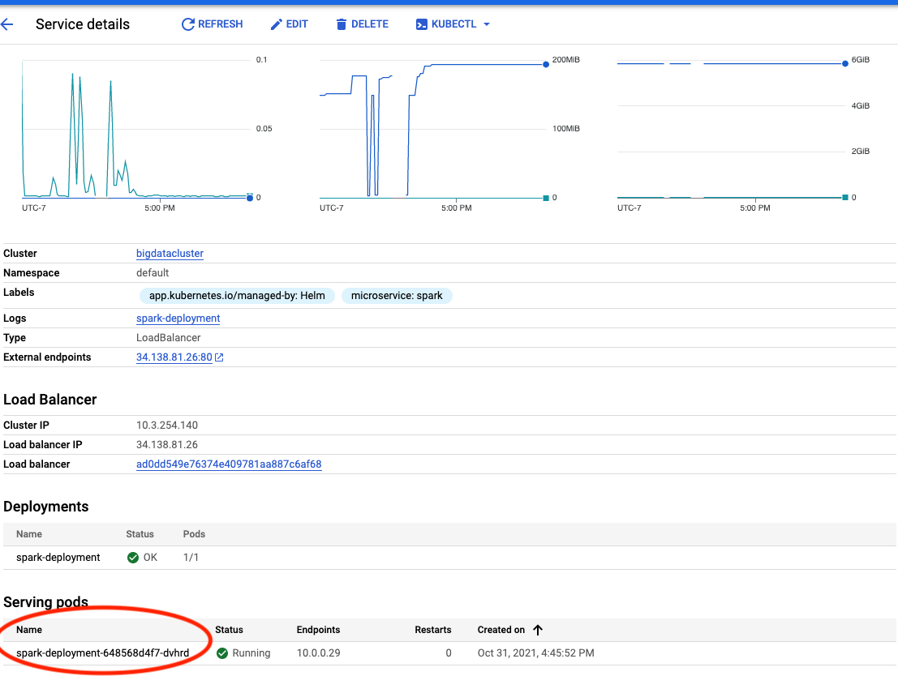

# big-data-processing-toolbox

## Images on Docker Hub
  UI App

   https://hub.docker.com/repository/docker/xxpan/big-data-app

  Jupyter Notebook

    https://hub.docker.com/r/jupyter/datascience-notebook
    docker pull jupyter/datascience-notebook:latest

  Apache Spark

    https://hub.docker.com/r/bitnami/spark  
    docker pull bitnami/spark:latest

  Apache Hadoop (master and worker nodes)

  Namenode

    https://hub.docker.com/r/bde2020/hadoop-namenode
    docker pull bde2020/hadoop-namenode:2.0.0-hadoop3.2.1-java8

  Datanode

    https://hub.docker.com/r/bde2020/hadoop-datanode
    docker pull bde2020/hadoop-datanode:2.0.0-hadoop3.2.1-java8

  SonarQube

    https://hub.docker.com/_/sonarqube
    docker pull sonarqube:latest

## Prerequisites
- Install Docker
- Install GCP CLI
- Install kubectl
- Install Helm 

    https://helm.sh/docs/using_helm/#installing-helm
- Create GCP project
- Authenticate GCP CLI

      gcloud auth login

- Set GCP project

       gcloud config set project PROJECT_ID

## Get Ready
**Create Kubernete cluster**

    gcloud container clusters create bigdatacluster --zone=us-east1-d --num-nodes=1 --machine-type=custom-4-12288 
    gcloud container clusters get-credentials bigdatacluster --zone=us-east1-d

**Check kubectl context**

  Check if your kubectl context is set to the cluster that you created in the previous step.

    kubectl config get-contexts 
  
  Otherwise, set the default context to the cluster name

    kubectl config use-context CLUSTER_NAME    

## Install Helm charts for each service. Run the following instructions at the root of this repo  

**Deploy Jupyter Notebook**

    helm install jupyter helm/jupyter/

**Deploy Sonarqube**

    helm install sonarqube helm/sonarqube

**Deploy Spark**

  Step 1 - Install master 

      helm install spark-master helm/spark/master
      
  Step 2 - Install worker
      
  Find the spark master url (spark-service's pod name) in the spark-service details page on GCP.
  Open the sidebar -> Kubernetes Engine -> Clusters -> Services & Ingress -> Select the service named "spark-service" 

  Copy and paste the url to line 7 `helm/spark/worker/configMap.yaml` as shown below

Lastly, run

    helm install spark-worker helm/spark/worker

**Deploy Hadoop**

    helm install hadoop helm/hadoop

**Deploy UI Application**

    helm install ui-app helm/ui-app
