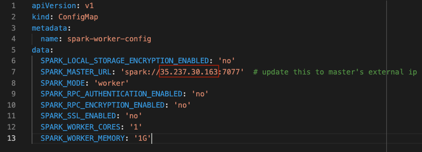

# big-data-processing-toolbox

## Images on Docker Hub
  UI App

   https://hub.docker.com/repository/docker/xxpan/big-data-app

  Jupyter Notebook

    https://hub.docker.com/r/jupyter/datascience-notebook
    docker pull jupyter/datascience-notebook:latest

  Apache Spark

    https://hub.docker.com/r/bitnami/spark  
    docker pull bitnami/spark:latest

  Apache Hadoop (master and worker nodes)

  Namenode

    https://hub.docker.com/r/bde2020/hadoop-namenode
    docker pull bde2020/hadoop-namenode:2.0.0-hadoop3.2.1-java8

  Datanode

    https://hub.docker.com/r/bde2020/hadoop-datanode
    docker pull bde2020/hadoop-datanode:2.0.0-hadoop3.2.1-java8

  SonarQube

    https://hub.docker.com/_/sonarqube
    docker pull sonarqube:latest

## Prerequisites
- Install Docker
- Install GCP CLI
- Install kubectl
- Install Helm 

    https://helm.sh/docs/using_helm/#installing-helm
- Create GCP project
- Authenticate GCP CLI

      gcloud auth login

- Set GCP project

       gcloud config set project PROJECT_ID

## Get Ready
**Create Kubernete cluster**

    gcloud container clusters create bigdatacluster --zone=us-east1-d --num-nodes=1 --machine-type=custom-4-12288 
    gcloud container clusters get-credentials bigdatacluster --zone=us-east1-d

**Check kubectl context**

  Check if your kubectl context is set to the cluster that you created in the previous step.

    kubectl config get-contexts 
  
  Otherwise, set the default context to the cluster name

    kubectl config use-context CLUSTER_NAME    

## Install Helm charts for each service. Run the following instructions at the root of this repo  

<span style="color:blue">**Deploy Jupyter Notebook**</span>

    helm install jupyter helm/jupyter/

<span style="color:blue">**Deploy Sonarqube**</span>

    helm install sonarqube helm/sonarqube

<span style="color:blue">**Deploy Spark**</span>

Step 1 - Install master 

      helm install spark-master helm/spark/master
      
Step 2 - Install worker
      
Use the following command to find the pod name of the master, the pod name should start with "spark-deployment".

    kubectl get pods


Copy and paste the pod name to line 7 `helm/spark/worker/configMap.yaml` as shown below



Lastly, run the following to deploy worker

    helm install spark-worker helm/spark/worker

<span style="color:blue">**Deploy Hadoop**</span>

Step 1 - Install namenode

    helm install hadoop-namenode helm/hadoop

Step 2 - Install datanode

Find the pod name of the namenode

    kubectl get pods


Find the Pod IP and port of the namenode.

    kubectl describe pods NAMENODE_POD_N


Copy and paste the namenode pod IP to Line 24 in `helm/hadoop/datanode/deployment.yaml`. Change the IP address only, don't change the port number.


Lastly, run 

    helm install hadoop-datanode helm/hadoop/datanode

<span style="color:blue">**Deploy UI Application**</span>

Step 1 - Find the IP addresses and port for the following services, namenode, sonarqube-service, jupyter-service, spark-services.

    kubectl get service


Step 2 - Replace the service IP address from Line 4-7 in `big-data-processing-toolbox-app/src/App.js` with the IP adderss and port that you found in the previous step. Note that namenode services has the port number 9870.  

```
  namenode -> hadoopIp
  sonarqube-service -> sonarqubeIp
  jupyter-service -> jupyterIp
  spark-service -> sparkIp
```


Step 3 - Build the UI App Image

    docker build -t big-data-app:latest . -f docker/ui-app/Dockerfile

Step 4 - Push the image to a repo at your choice

    dokcer tag big-data-app:latest YOUR_REPO_NAME/big-data-app:latest
    dokcer push YOUR_REPO_NAME/big-data-app:latest

Step 5 - Set the image url at Line 19 in `helm\ui-app\deployment.yaml`

Step 6 - Install the UI app

    helm install ui-app helm/ui-app

## Nevigate to the UI app

Find the external IP of the `ui-app-service`, and paste the IP in the browser to see the UI app. Click on each link to neviagea to different microservices

      kubectl get service
  


